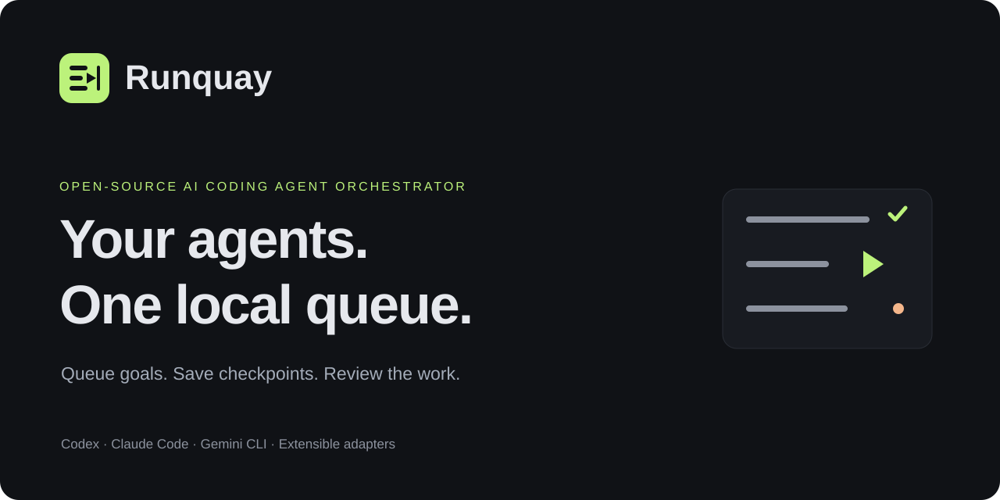
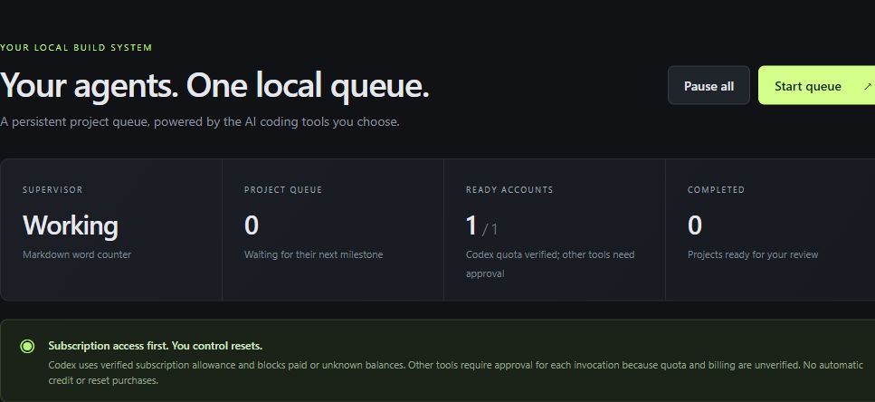
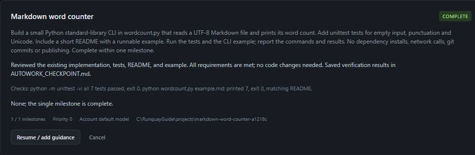

# Runquay — Open-source AI coding agent orchestrator

[](https://github.com/dibyapp/runquay/actions/workflows/ci.yml)
[](LICENSE)



**Your agents. One local queue.** Runquay is an open-source AI coding agent orchestrator for **OpenAI Codex, Claude Code, Gemini CLI, and Antigravity CLI**. Turn project goals into a durable task queue, get evidence-based project suggestions, and manage accounts, approvals, and handoffs from one dashboard.

Runquay runs official coding CLIs on your own machine. No hosted service, telemetry, Python packages, or separate model API key is required by Runquay. Individual tools have their own accounts, requirements, and costs. MIT licensed.

Self-hosted on your own computer, Runquay brings AI coding workflow automation and task scheduling to Windows, macOS, and Linux, including Ubuntu. The dashboard and orchestration stay local; coding requests still go to your selected AI provider. See the [verification record](docs/VERIFICATION.md) for tested platforms and integration limits.

Previously the AutoWork prototype. Existing state and the `autowork.py` launcher remain compatible. [Brand and research](docs/BRAND_RESEARCH.md).

Created and maintained by [Dibyaprakash Pradhan](https://github.com/dibyapp). [Download the latest release](https://github.com/dibyapp/runquay/releases/latest) · [Report a bug](https://github.com/dibyapp/runquay/issues/new/choose).

## See Runquay in use

Actual screenshots from a Windows installation using real Codex execution. The walkthrough built a Markdown word counter, passed seven tests, and verified its CLI output. Views are cropped to exclude unrelated private projects and personal paths; no UI values or execution results were fabricated. [Capture details](docs/SCREENSHOTS.md).





**Detailed guides:** [Getting started](docs/GETTING_STARTED.md) · [Daily workflows](docs/WORKFLOWS.md) · [Troubleshooting](docs/TROUBLESHOOTING.md) · [Screenshot gallery](docs/SCREENSHOTS.md)

## Start in one command

Install **Python 3.11+**, **Git**, and at least one vendor CLI. Download the source ZIP, extract it, and open a terminal in the extracted `runquay` folder:

```sh
python runquay.py start
```

Use `python3` on macOS/Linux if needed. Windows users can double-click `start.cmd`; macOS/Linux users can run `sh start.sh`. Open [localhost:8765](http://127.0.0.1:8765/) if the browser does not open.

The guided onboarding walks through four steps:

1. **Tools** — detect CLIs and open official installation documentation.
2. **Accounts** — reuse a current login or create an isolated profile; authenticate through the vendor.
3. **Workspace** — choose where new projects live and connect existing project folders.
4. **Review** — understand workspace access, tool permissions, and billing before finishing.

Describe a goal and its acceptance criteria, choose its AI tool, then **Start queue**. First installations start paused. Finishing setup does not start work. Revisit the setup guide from Settings anytime.

## AI coding workflow automation

- Persistent, prioritized project queue with bounded milestones, pause/resume, blockers, and file-based handoffs.
- Real AI planning: useful improvements and new projects with evidence, a first milestone, and editable goals before queuing.
- **No account-count cap.** Add as many profiles as you need; one worker runs at a time.
- Codex quota checks, reserve before exhaustion, selection of eligible profiles, and approval for earned resets.
- Explicit per-task tool selection. No silent cross-provider fallback or copying of conversation history.
- Local SQLite state, private run logs, a loopback-only dashboard, and opt-in startup services.

Use Runquay to schedule coding tasks across existing repositories, build a new project through bounded milestones, or resume a long-running development workflow from saved checkpoints. For Codex automation, it can select an eligible account when subscription quota runs low. Claude Code automation and the other CLI adapters use the same task queue, with explicit approval for each invocation when billing is unverified.

## Codex, Claude Code, Gemini CLI, and Antigravity support

| Tool | Execution / advisor | Accounts | Verification |
| --- | --- | --- | --- |
| Codex | Native `exec`, schema, workspace sandbox / read-only advisor | Separate `CODEX_HOME` profiles | Live model execution tested on Windows; quota guard tested |
| Claude Code | Print JSON/schema, scoped tools / plan mode with Read/Glob/Grep only | `CLAUDE_CONFIG_DIR` profiles; verify vendor auth isolation on your OS | Installed CLI flags checked; synthetic execution contracts tested |
| Gemini CLI | Headless JSON, edit approval mode, vendor sandbox / plan advisor | Separate `GEMINI_CLI_HOME` profiles | Contract tested; account execution not live-tested here |
| Antigravity CLI (`agy`) | Print JSON/schema, vendor sandbox / advisor disabled pending verified read-only policy | Current login; custom wrapper for isolation | Contract tested; not live-tested here |
| Other headless tools | Custom argv, prompt on stdin, checkpoint JSON on stdout / advisor disabled | Wrapper owns isolation | Adapter-specific permissions, auth, and billing |

Runquay is extensible to other tools; **not every AI product provides a compatible CLI**. Antigravity's editor is distinct from `agy`. GUI-only products need a headless bridge. Built-in adapters never enable permission bypass. Missing permissions or dependencies surface as blockers. [Tool setup and official references](docs/TOOLS.md).

## Accounts and billing

Use **Accounts → Add account** and give each profile a recognizable local name. The sign-in guide shows the correct profile environment and official CLI command. Runquay never requests passwords, copies auth files, or exports vendor sessions. Non-Codex detection confirms the executable; the first approved invocation verifies authentication.

**Codex:** requires ChatGPT subscription auth and verified zero paid credits with no unlimited credit entitlement. Official quota checks run before each milestone and every 15 seconds. Positive or unknown paid balances fail closed. At the reserve (90% used by default), Runquay stops and selects another eligible Codex profile; otherwise it waits for natural refresh. Existing earned resets require approval. Durable idempotency IDs protect reset retries. No purchase or paid-continuation feature is implemented.

**Other tools:** quota and billing are unverified. **Each invocation, subsequent milestone, and retry needs explicit approval.** Check vendor billing and authentication first; approval permits one invocation and any charges the vendor may apply. No automatic external approval or credit/reset purchase occurs. External errors do not automatically rotate accounts; disable an unavailable profile and resume with another for that tool.

Common inherited provider API keys and billing-routing environment variables are removed from workers. CLIs can still have their own paid authentication on disk. **Polling is not an atomic spending guarantee.** Pause before changing credits or billing elsewhere. Unlimited profiles do not increase provider allowances or bypass provider policies; use only accounts you control under their permitted terms.

## Existing work and AI suggestions

Saved Codex desktop roots are discovered without modifying Codex state. Use **Connect folder** for other existing projects. Discovery reads bounded README previews and top-level filenames, not your whole disk. Recent Codex chat previews can inform planning. Requested advisor analysis sends relevant project context to the selected provider.

Existing workspaces retain files, instructions, and Git history. New projects get separate Git workspaces in your chosen root. One active task per workspace prevents conflicting edits. The running Runquay installation cannot edit itself through its queue; develop in a separate checkout.

Select a planning tool and **Ask AI**. Supported advisors use native read-only modes. **Review & queue** lets you edit the proposal and choose the execution tool. Proposed builds never start automatically. Automatic planning defaults to six-hour intervals while enabled, behind build tasks; non-Codex planning still requires invocation approval.

## Task scheduling and long-running coding workflows

Each turn completes one milestone, runs checks, and writes `AUTOWORK_CHECKPOINT.md` plus a structured result. Later accounts continue from files; conversation history is not transferred. Agent-reported completion needs your review. Milestone caps, timeouts, and three-failure limits bound work.

Pause/cancel stops the child tree and preserves files. Windows uses Job Objects; Unix uses process groups and graceful shutdown. Linux service control groups also stop children on service exit. A hard-killed standalone Unix supervisor can leave child groups: prefer a user service for continuous use. Worker-launched dev servers stop with the milestone; launch finished apps separately.

The machine must stay powered on, connected, and signed in when required. Keep-awake is best effort: Windows execution state, macOS `caffeinate`, Linux `systemd-inhibit` when installed and permitted. It cannot override shutdown, lid-close policy, forced sleep, or updates.

```sh
python runquay.py service preview
python runquay.py service install
python runquay.py service uninstall
```

Startup is opt-in and per user: Task Scheduler on Windows, LaunchAgent on macOS, user systemd service on Linux/Ubuntu. Linux normally starts with the user session; after-logout behavior depends on system configuration. Other Unix systems can use their own user process manager with `python supervisor.py`. Removing startup retains data. [Operations and storage](docs/OPERATIONS.md).

## Privacy and releases

The dashboard binds only to `127.0.0.1`, validates Host and Origin, rejects cross-site loads, and uses an HttpOnly SameSite cookie, CSRF checks, and restrictive content policy. Do not expose it through a proxy or tunnel. Processes running as your OS user share the trust boundary. Tool permissions vary; the custom adapter provides no additional sandbox.

**Do not publish this working folder wholesale.** Accounts, databases, logs, personal screenshots, generated projects, and personal configuration are private. Runtime folders are excluded by `.gitignore`; release packaging includes only allowlisted source and explicitly reviewed documentation images. It scans for likely credentials, private home paths, personal emails, and sensitive Git history:

```sh
python runquay.py release --check
python runquay.py release
```

Publish the inspected versioned `dist/runquay-<version>-source.zip` and its SHA256 checksum, or seed a clean repository from that archive. Only explicitly reviewed documentation JPEGs with pinned SHA256 hashes enter the bundle; arbitrary screenshots remain excluded. A pattern scan cannot prove arbitrary text or image content is non-sensitive; review all included files and history. [Security](SECURITY.md) · [Release checklist](RELEASE_CHECKLIST.md).

## Development and verification

```sh
python -m unittest discover -s tests -v
node --check web/app.js
node --check web/setup.js
python runquay.py doctor
```

Deterministic tests use temporary folders and synthetic CLIs, with no model requests. Node is needed only for JS syntax checks. The optional `python tests/live_check.py` consumes Codex subscription allowance.

GitHub Actions is configured for Windows, Ubuntu, and macOS on Python 3.11 and 3.13. **Configured CI is not a completed CI run.** Local verification covers Windows and Ubuntu 24.04 under WSL. macOS startup is definition-tested and needs a real macOS run. [Verification details](docs/VERIFICATION.md).

If Runquay helps your workflow, star the repository to follow its progress. Reproducible bug reports are welcome.

Read [CONTRIBUTING.md](CONTRIBUTING.md) to add adapters or platform support. Runquay is independent of OpenAI, Anthropic, and Google.
