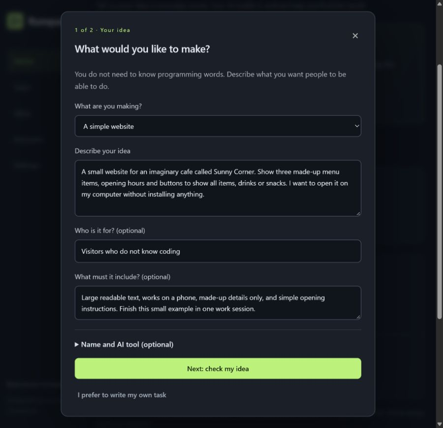
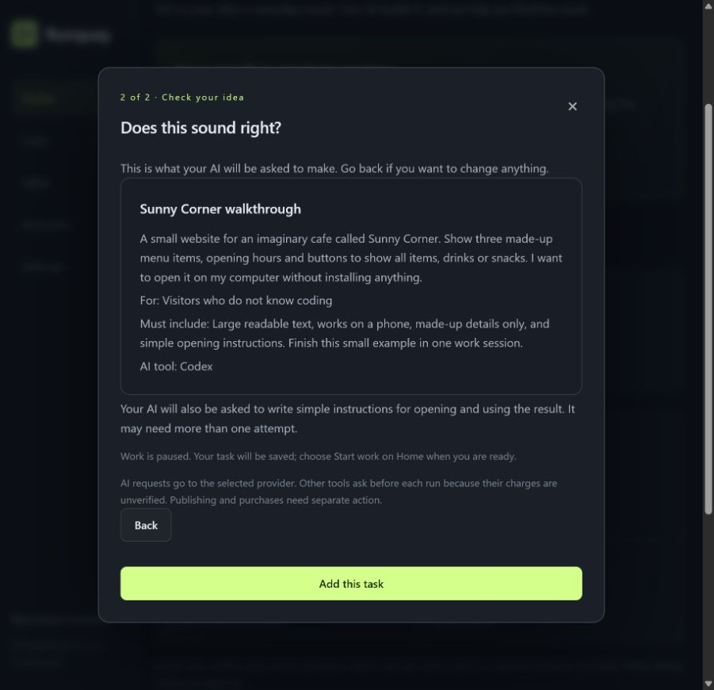
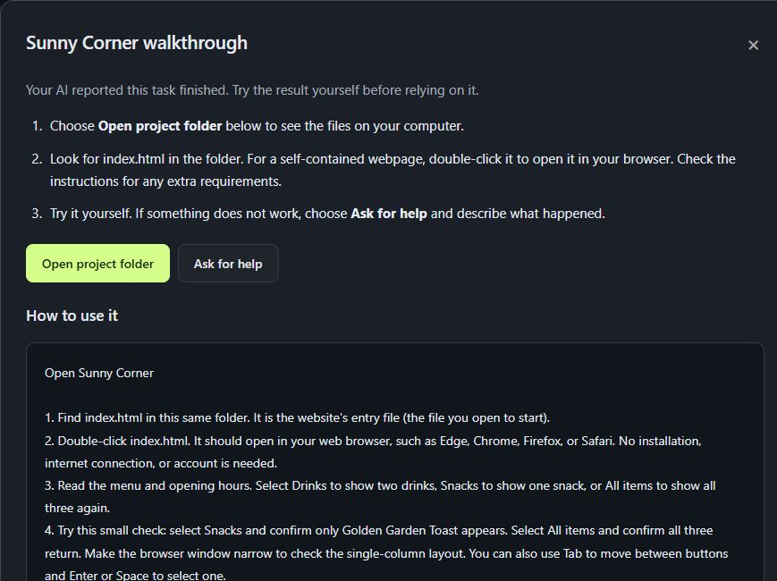

# Start here if you do not know coding

Runquay lets you describe something you want in everyday words, ask an AI coding tool to make it, and find the finished files. You do not need to choose a programming language for a small first project.

**Good first projects:** a personal webpage, a daily checklist, or a simple expense tracker using made-up examples. Start small so you can tell whether the result does what you asked.

Runquay needs a one-time setup. It is not yet a standalone installer: Python, Git and a supported AI helper must be installed separately. Your AI provider may require a subscription or apply charges. Runquay itself is free and open source.

## 1. Prepare your computer

- **Python 3.11 or newer** runs Runquay. Get it from [python.org](https://www.python.org/downloads/). On Windows, select the installer's option to add Python to PATH. PATH is the list of places your computer searches for programs.
- **Git** keeps new project folders organized. Get it from [git-scm.com](https://git-scm.com/downloads). You do not need to learn Git commands for your first task.
- **An AI helper** connects Runquay to your chosen coding service. Having a ChatGPT, Claude or Gemini chat account alone does not install that helper. The [tool setup page](TOOLS.md) links to official installation instructions. Sign in through the provider; never paste passwords or tokens into Runquay.

A **terminal** is an app where you type instructions for your computer. On Windows, use PowerShell; on Mac or Linux, use Terminal. You may need it to install or sign in to the AI helper. After setup, everyday Runquay tasks use the dashboard buttons.

## 2. Open Runquay

Download the source ZIP from [the latest release](https://github.com/dibyapp/runquay/releases/latest). Extract it first; do not open the launcher while it is still inside the ZIP.

| Computer | What to open |
| --- | --- |
| Windows | Double-click **start.cmd** in the extracted folder. Windows may display it simply as **start** if filename extensions are hidden. |
| Mac | Open **start.command** in the extracted folder. Its terminal window starts the local dashboard. |
| Linux / Ubuntu | Open Terminal in the extracted folder and enter **sh start.sh**, then press Enter. File managers vary, so double-click behavior is not assumed. |

If you prefer a terminal, enter `python runquay.py start` in the extracted folder. Mac/Linux may call Python `python3`. If you need to navigate to the folder, type `cd `, drag the extracted folder into the terminal, then press Enter. `cd` means change folder.

Runquay opens [its dashboard](http://127.0.0.1:8765/) in your browser. This address belongs to your own computer. Keep the launcher window running while the AI works. Closing the browser tab alone does not stop work.

If a prerequisite is missing, the launcher explains what to install. The Windows and Mac launchers keep the error visible. More startup help is in [troubleshooting](TROUBLESHOOTING.md).

## 3. Follow the setup guide

1. **Tool:** find the AI helper you installed. **Installed** means the program was found; it does not prove you are signed in. Follow **Installation guide** if it is missing.
2. **Account:** if a Codex account says **Subscription verified**, continue. Otherwise choose **Sign-in guide**. Use **Copy sign-in instruction**, paste it into your terminal, press Enter and complete the provider's sign-in. Return and choose **Check connection**. Other tools verify authentication through a separately approved run.
3. **Folder:** keep the suggested folder unless you want to change it. A project folder is simply where the files made for one task are stored.
4. **Ready:** read the workspace and billing rules, tick the acknowledgement, and choose **Finish setup**. New installations start paused.

Setup does not purchase a plan or authorize a reset. If a sign-in command reports an error, keep the error text and follow the provider's official instructions rather than pasting passwords into Runquay.

## 4. Describe one idea

On Home, choose **Help me build something**. Or expand **Not sure where to start? Try an example** and choose an editable starter. Selecting a starter does not use AI allowance or start a task.

Fill in:

- **What are you making?** Choose a website, tracker, tool, or something else.
- **Describe your idea:** say what someone should be able to do. For example: “A page for my bakery with a menu and opening hours.”
- **Who is it for?** Optional. “My customers” is enough.
- **What must it include?** Optional. “Works on my phone and uses large text” is a useful requirement.

You can leave the name and AI tool at their suggested values. Expand **Name and AI tool (optional)** to change them. If you already know exactly what to ask, choose **I prefer to write my own task** for the original form.

Choose **Next: check my idea**. Read the summary. **Back** keeps your answers so you can change them.

Read the work-status note before **Add this task**. If work is paused, your idea is saved and waits for **Start work** on Home. If work is already on, adding it can start AI work immediately when an account is available. The guide uses up to three work sessions before asking for review; this is a limit, not a promise of completion.

## 5. Let the AI work

Home explains what is happening. **Waiting** means the task is saved. **Working** means an AI session is active. **Needs you** means the AI or app needs your help. Use **Pause work** on Home whenever you need to stop; files already written remain.

The computer must stay on and connected. Runquay cannot continue working while it is shut down. Other AI tools ask before each run because Runquay cannot verify their billing. You can decline a request or wait. No credits or resets are purchased automatically.

## 6. Open and try the result

When Home says a result is ready, choose **Review results**, then **See what was made** on the finished task.

1. Read **How to use it**.
2. Choose **Open project folder**. This asks your computer's file manager to show the project's files; it does not run them.
3. Follow the opening instructions. A simple self-contained webpage usually uses a file called **index.html** that you can double-click. More complex apps may require additional setup; read their instructions first.
4. Try a small example. For a checklist, add an item, mark it done and reload the page to check the stated saving behavior.

The guided task asks the AI to write **START_HERE.md**, a file with plain opening instructions. Older projects may show their README instead. If no instructions exist, the screen explains how to ask for them.

**Done** means the AI reported completion. Try the result yourself before relying on it. The dashboard displays instructions as text and does not automatically execute generated code. The project is not automatically published to the internet.

## 7. Ask for a change or help

Choose **Ask for help** from the result screen. Add your difficulty after the suggested message, such as “I cannot find the file” or “the Add button does nothing.” Review the message and choose **Continue task** to submit it. Merely opening the help form does not start another AI request.

For a change, choose **Add follow-up** on the finished task and describe the new behavior: “Make the text larger” or “Add a way to delete an entry.” You do not need to diagnose the code yourself. More AI work can consume allowance or need another approval.

## A few words you may see

| Word | Meaning here |
| --- | --- |
| Task | One thing you ask your AI to make or improve. |
| Project | The files that belong to something you are building. |
| AI tool / helper / CLI | The provider's program that Runquay asks to do the work. CLI means command-line interface. |
| Step / work session | One bounded attempt by the AI, with progress saved afterward. |
| Allowance / quota | How much AI usage your provider currently permits. |
| Check / test | A way to see whether the result behaves as expected. |
| Publish / deploy | Make the project available to other people, usually online. This is a separate action. |

For more detail, see [getting started](GETTING_STARTED.md), [daily workflows](WORKFLOWS.md) and the [tested-platform record](VERIFICATION.md).
