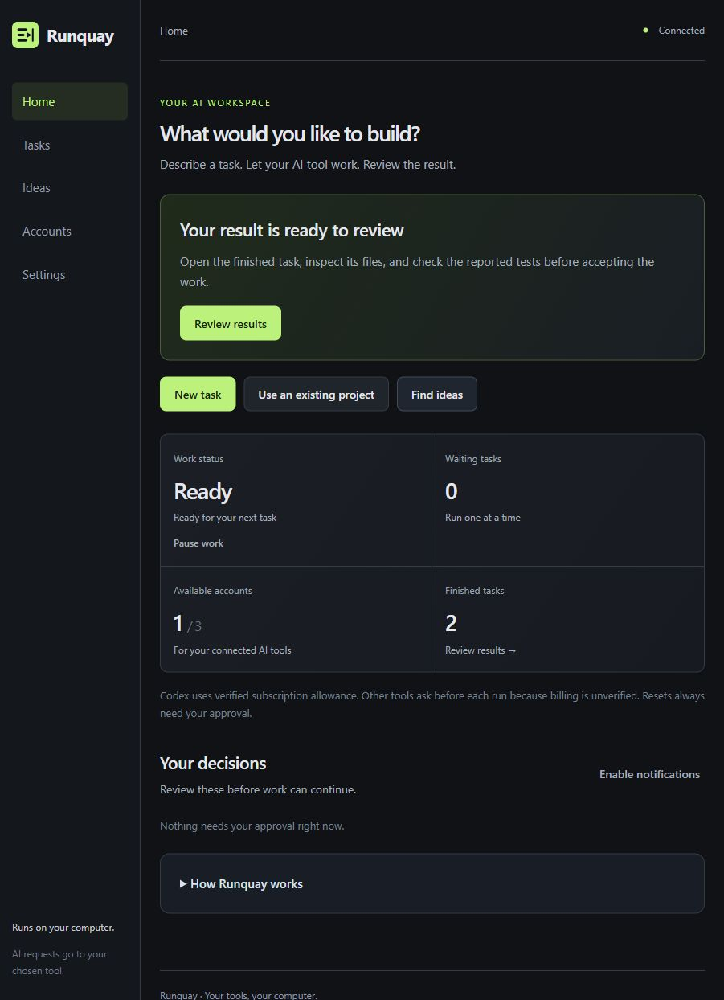
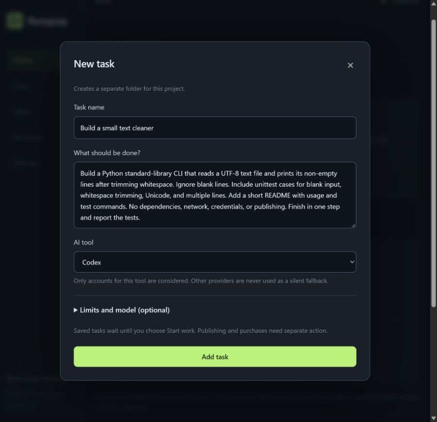
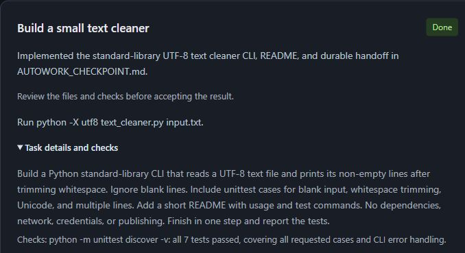
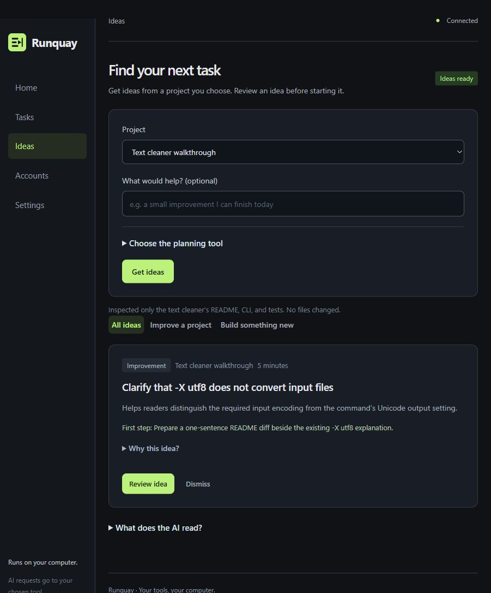

# Getting started with Runquay

**New to coding?** Follow the [beginner guide](BEGINNERS.md) for setup explanations, an idea form and opening your result.

Runquay runs your existing AI coding CLI on your computer. You describe a goal, choose the tool, and let a persistent local queue work through bounded milestones. This guide covers installation, all four onboarding steps, and your first task.

**Start here:** [Install](#1-install-the-prerequisites) · [Onboard](#3-complete-the-four-setup-steps) · [Add a task](#5-add-one-small-task) · [Review the result](#6-start-work-and-review-the-result)

For day-to-day use, read the [workflow guide](WORKFLOWS.md). For problems, use [troubleshooting](TROUBLESHOOTING.md). Check the [verification record](VERIFICATION.md) before assuming an OS or provider has been live-tested.

## 1. Install the prerequisites

You need **Python 3.11 or newer**, **Git**, and a supported vendor CLI with an account you are permitted to use. Runquay itself requires no Python packages. Individual AI tools may require Node, a sandbox runtime, authentication, or a paid subscription of their own.

### Windows

Install Python from [python.org](https://www.python.org/downloads/windows/) and Git from [git-scm.com](https://git-scm.com/downloads). Enable Python's PATH option when the installer offers it. Open a new PowerShell window after installation and check:

```powershell
py -3 --version
git --version
```

If the Python launcher is unavailable, try `python --version`. The version must be at least 3.11. If a command is missing, finish installation and reopen the terminal before continuing.

### macOS

Install a current Python from [python.org](https://www.python.org/downloads/macos/) and Git from [git-scm.com](https://git-scm.com/downloads). In Terminal, check:

```sh
python3 --version
git --version
```

Runquay's deterministic suite runs in macOS CI. That does not establish that vendor authentication, sandboxing or LaunchAgent installation has been manually exercised on your Mac.

### Ubuntu / Debian-based Linux

Install Python and Git through your distribution's package manager. On Ubuntu:

```sh
sudo apt update
sudo apt install python3 git
python3 --version
git --version
```

Confirm Python is 3.11+. Older distribution releases may need a newer supported Python installed through an appropriate source. Other Linux distributions use their own package names and service managers; the guide does not assume every distribution was tested.

### Install an AI coding tool

Use the tool's official installation instructions linked in [TOOLS.md](TOOLS.md). Authenticate through its official CLI or browser sign-in flow. Runquay does not install the vendor tool or take your password.

| Tool | What to expect in Runquay |
| --- | --- |
| Codex | Subscription authentication, verified quota and zero paid balance are required before a milestone starts. |
| Claude Code | CLI detection and adapter contracts are checked; each invocation needs approval because billing is unverified. |
| Gemini CLI | Contract-tested adapter; install and validate the vendor runtime and account on your machine. Each invocation needs approval. |
| Antigravity CLI | Requires the compatible headless `agy` tool. Editor installation alone is insufficient; isolated-home behavior and read-only planning are unverified. |
| Custom CLI | Supply a headless wrapper with the documented JSON result contract. The wrapper owns permissions and authentication. |

## 2. Download and start Runquay

Get the source ZIP from [GitHub Releases](https://github.com/dibyapp/runquay/releases/latest). Extract it into a folder you can write to. Keep the checkout at a stable location if you later enable startup services. Alternatively, clone the current source:

```sh
git clone https://github.com/dibyapp/runquay.git
cd runquay
```

In the extracted or cloned folder, start the launcher.

Windows:

```powershell
py -3 runquay.py start
```

macOS / Linux:

```sh
python3 runquay.py start
```

Windows can also open `start.cmd`; macOS can open `start.command`; macOS/Linux can use `sh start.sh`. The launcher opens [127.0.0.1:8765](http://127.0.0.1:8765/). Keep the terminal running while using a foreground instance. Ctrl+C stops it; closing the browser tab alone does not stop the queue.

If Python is called `python` on your machine, substitute it in these commands. Do not expose the dashboard through a public proxy or tunnel. It is a local, single-user application.

## 3. Complete the four setup steps

The guide opens on a new installation. You can reopen it at **Settings → Open setup guide**. Setup retains existing accounts, projects and the current work start/pause state.

### Step 1 — Tool

Installed tools appear first; expand **Other supported tools** for more adapters. **Installed** confirms executable detection, not account authentication. Use **Installation guide** to find vendor setup instructions. Runquay makes no model request during detection.

Choose the **Tool for project ideas**. Only advisors with an enforced read-only mode are offered. Antigravity and custom tools currently support execution adapters but have no verified read-only advisor.

### Step 2 — Account

When the chosen tool shows **Codex is ready**, choose **Next**: its login is already verified. Otherwise use **Connect account** or its sign-in/check controls. **Use another account** is optional.

The account dialog shows installed tools as buttons. Choose a tool, then **Connect**; names and paths are filled automatically. A current login already connected says **Done**, without creating a duplicate. **Sign in to another account** creates a separate profile and opens sign-in. Codex offers a browser sign-in button; other tools show their vendor instructions. Optional names, other tools and custom commands are under **More options**. Detection confirms installation; it does not prove authentication or billing.

A verified Codex subscription displays **Codex is ready**. For a separate Codex profile, choose **How to sign in → Sign in with Codex**. The official CLI opens ChatGPT browser OAuth and Runquay checks the connection when it completes. **Cancel sign-in** stops an attempt; **Use terminal instead** contains the exact profile command and **Check connection** fallback. Existing shared Codex app credentials are refreshed through Codex itself. Other tools use **Sign-in instructions** in your terminal. Other tools' authentication is established by a separately approved invocation, not detection alone.

There is no application account-count cap. Additional profiles do not increase provider allowances. Never paste passwords, API keys or auth files into Runquay.

### Step 3 — Folder

Choose an absolute writable **New-project folder** on this computer. Each new task creates a separate Git workspace inside it. Existing tasks keep their paths when you change this root.

**Connect a project folder** adds an existing directory without moving or editing its files. Import reads filenames and a bounded README preview. Saved Codex desktop roots are discovered automatically; projects from other tools can be connected by folder.

### Step 4 — Ready

Review workspace access and billing, select **I understand the workspace access and billing rules**, then **Finish setup**. First installations stay paused. This acknowledgement does not authorize a reset, a paid tool run or a purchase.

## 4. Learn the five pages



| Page | Use it for |
| --- | --- |
| **Home** | See the next step, start/pause work, and review approval requests. |
| **Tasks** | Create work, view in-progress/finished tasks, and use existing folders. |
| **Ideas** | Ask AI for project suggestions, then review a proposal before adding it. |
| **Accounts** | Connect tools, check sign-in and expand usage/account options. |
| **Settings** | Configure automatic ideas, work limits, setup and troubleshooting output. |

## 5. Add one small task

Choose **Help me build something** on Home or **New task** in Tasks. The two-screen guide asks what you want to make, who it is for and any must-have features. Review the idea before adding it. Starter examples are available on Home. See the [beginner walkthrough](BEGINNERS.md).

For the original form pictured below, choose **I prefer to write my own task**. Enter a name, goal and AI tool. Expand **Limits and model (optional)** only if you need a step cap, priority or model. A step is one bounded work session.



The browser test used a Python CLI that reads a UTF-8 file, trims lines, skips blanks, and includes tests for empty input, whitespace, Unicode and multiple lines. It required no dependencies, network access or publication.

Choose **Add task**. If work is paused, the task shows **Waiting**, and Home offers **Start work**. When work is already enabled, adding a task can start it as soon as an eligible account is available. Read the form's note before submitting.

For an existing repository, choose **Tasks → Use an existing project**, find the folder and choose **Add task**. Use **Connect folder** if it is missing. Review or back up current changes before an agent edits that repository.

## 6. Start work and review the result

Use **Start work** on Home. The next-step card explains whether work is waiting, active or needs your approval. **View task** opens the in-progress task. **Pause work** stops scheduling and active child work; written files remain.

Codex needs verified subscription quota and zero paid balance. Other providers ask for approval before each invocation because billing is unverified. Review any request on Home; declining or waiting remains available. Runquay does not purchase credits or resets.

When a task finishes, choose **Review results** on Home or **Finished** in Tasks. Choose **See what was made** for opening instructions, **Open project folder**, and **Ask for help**. The handoff displays START_HERE.md when present, with README fallback. It does not execute project files. Expand **Task details and checks** for its goal, reported tests, folder, tool and step count. **View output** opens the detailed run log, which may contain private project information.



Inspect the files and `AUTOWORK_CHECKPOINT.md`, and independently run relevant checks. **Done** means the agent reported completion; it does not certify the code. The illustrated text cleaner passed all seven tests independently. Choose **Add follow-up** for further work; inspect existing edits before continuing an interrupted task.

Launch completed apps separately: worker-launched development servers stop with the step. Publishing, deployments and purchases require separate action.

## 7. Find your next task

Open **Ideas**, choose a project and optionally enter a focus. Select **Get ideas**. If work is paused, choose **Start work to get ideas**. The selected project also filters saved proposals; **All my projects** includes new-project ideas.



Open **Why this idea?** to inspect evidence, then **Review idea** to edit the goal and choose the execution tool. A suggestion alone never starts a build. Requested planning sends relevant context to the selected provider. Change providers under **Choose the planning tool**.

## Next steps

- [Workflow guide](WORKFLOWS.md): existing repositories, AI suggestions, approvals, recovery and continuous use.
- [Troubleshooting](TROUBLESHOOTING.md): detection, quota, execution, state and startup issues.
- [Tool setup](TOOLS.md): adapter authentication, output contracts and verification boundaries.
- [Operations](OPERATIONS.md): data locations, backups, per-user startup and shutdown.
- [Security](../SECURITY.md): the local trust boundary and safe reporting.


## Automatic setup

For a fresh computer, use **setup.cmd**, **setup.command** or **sh setup.sh** instead of manually preparing every dependency. The dashboard detects the OS, recommends an installed tool, lists missing software and offers **Install missing tools**. A new connection is created automatically on Next; sign-in remains with the vendor. [Full setup and permission guide](SETUP.md).

## Find tasks you already have in Codex

The current **Tasks → Existing AI tasks** view combines Codex, Claude Code, Gemini CLI and available Antigravity local histories. Choose an **AI tool**, search for a title or project, then open **Task summary**. **Refresh tasks** checks again without starting AI work. Other tools can use **Import history** with a compatible metadata JSON file.

The local queue belongs to this Runquay installation. A saved conversation is separate from that queue; open its original tool to continue it. Missing folders, older encrypted history and unsupported cloud exports are explained rather than guessed. [Detailed guide, supported sources and import example](TASK_HISTORY.md).
