# Actual Runquay screenshots and test record

## Codex browser sign-in — 0.4.2, 9 October 2026

Actual capture from the running Windows walkthrough in the Codex in-app browser. The separate account now offers one browser sign-in action, with terminal instructions collapsed. The screenshot contains no account email, sign-in URL, credentials or private home path. It was reviewed and hash-pinned before publication.

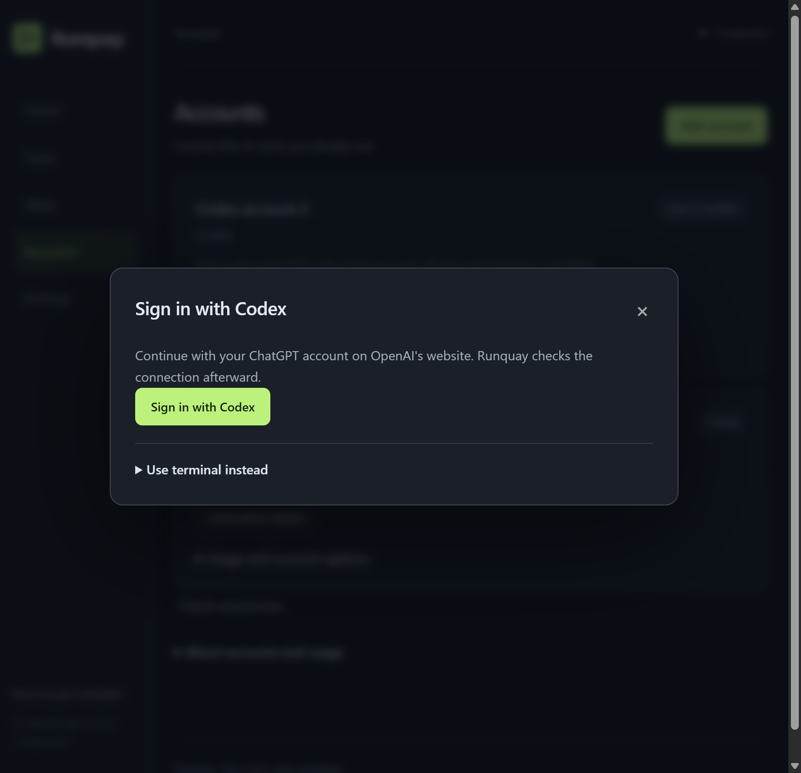

A temporary isolated profile tested real CLI launch, local OAuth callback startup, waiting progress, cancellation and retry availability. It was unlinked afterward; the user's current and additional profiles were retained. No account credential was entered, OAuth consent completed, model request made, credit bought or reset redeemed. Successful sign-in completion and automatic verification are covered by mocked lifecycle tests; live completion requires the user's own sign-in.

## Current account setup — 0.4.1, 9 October 2026

These are actual captures of the separate Windows walkthrough in the Codex in-app browser. The current Codex account was found and its subscription checked by the real backend. The account dialog shows the actual installed tools, with optional fields collapsed. No account email, credentials, private paths or unrelated project details are visible. Both images were reviewed and hash-pinned.

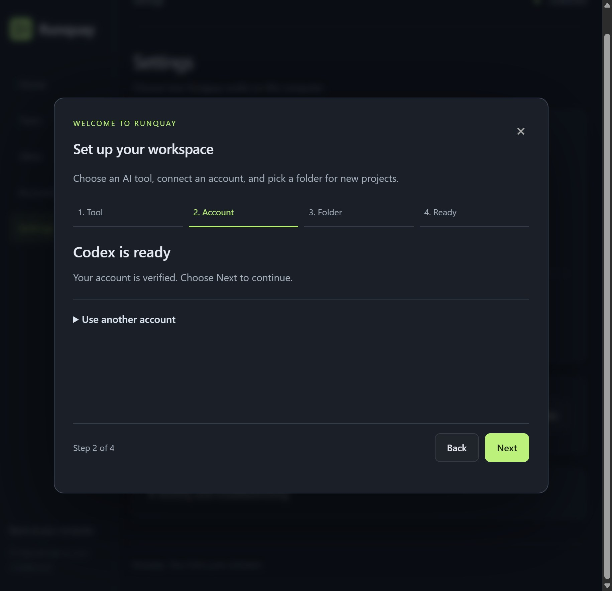

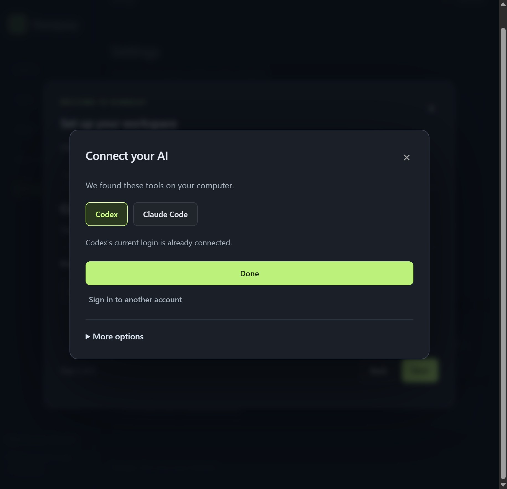

The browser check covered duplicate-free Done, selecting and connecting a detected Claude tool without typing a name, opening separate Codex sign-in instructions, hidden optional fields, absent Antigravity and accessible custom setup. Temporary connections were removed; no vendor model invocation or sign-in was executed. See [verification details](VERIFICATION.md).

## Beginner task flow — 0.4.0, 9 October 2026

Actual captures from the running Windows app in the Codex in-app browser. The fictional cafe idea was submitted to real Codex and completed in one step. These screenshots contain no account email, credential, sign-in command, private home path or unrelated project contents. All three image files were reviewed and hash-pinned before publication.

The walkthrough tested required fields, an editable starter, Back with retained input, saving while paused, starting work, completion, the result dialog, opening the folder and an editable help message. The help message was closed without submitting it. The generated check script passed independently; the actual menu controls were tested over a local HTTP preview: two drinks, one snack and all three items, including keyboard activation.

The worker's headless screenshot attempt was denied by Windows; the public captures above came from the interactive in-app browser. That browser also rejected direct file:// opening, which remains unverified. No restriction was bypassed. No paid credit/reset or other-vendor model request was used. Original accounts and work settings were restored. See [the beginner guide](BEGINNERS.md) and [verification limits](VERIFICATION.md).

## Earlier focused interface — 0.3.0, 9 October 2026

These are actual captures of the running Windows app in the Codex in-app browser, using the real backend and an authenticated Codex subscription. No API responses, account values or generated results were mocked. Home and Ideas are full-page captures; the result is cropped before the private folder path. The form contains the actual goal submitted for this test.

The browser test completed onboarding with its acknowledgement, retained existing connections and workspace, created a one-step text-cleaner task while paused, started real Codex work, inspected output and finished-task checks, imported the resulting folder, and requested a read-only advisor analysis scoped to that project. The proposed README clarification was reviewed and submitted as a follow-up. Independent execution of the generated suite passed seven tests.

The external-provider path was checked without authorizing an invocation: a temporary Claude connection and disposable task exercised the billing acknowledgement, decline and cancellation flow. The temporary connection was unlinked, retaining vendor credentials. No Claude model request, paid reset or purchase was made. Existing user settings were restored after testing.

Screenshots contain no account email, credentials, sign-in command, private home path or unrelated project contents. Profile/task counts are actual counts. All public image bytes are explicitly reviewed and hash-pinned. See [verification](VERIFICATION.md) for limits.

## Historical interface — 0.2.1

The following ten images document the earlier layout. Their button labels and navigation differ from 0.3.0; use the [current setup guide](GETTING_STARTED.md) for present instructions.

These images were captured from the running application on **8 October 2026, Windows**, using the real backend, current vendor tool detection and an authenticated Codex subscription. The documentation session used a separate data directory and a real project at `C:\RunquayGuide\projects`. No mock API responses, invented accounts, simulated quota values or fabricated completion results were used for these screenshots.

Images are cropped browser captures of the relevant panel or dialog. Unrelated private projects, personal home paths, sign-in commands, identifiers and account quota details are outside the published views. The generic path shown is the actual path used for this test. Setup counts reflect the actual discovered library; the library itself is not pictured.

## What was tested

1. Start a separate foreground installation on port 8766 with a separate data directory. Confirm the original installation is unaffected.
2. Detect installed CLIs and verify the existing Codex login through the real quota guard. No new credentials are copied or included in the screenshots.
3. Complete the four onboarding steps with `C:\RunquayGuide\projects` as the new-project root. Keep automatic advisor requests disabled for this bounded test.
4. Create **Markdown word counter**, select Codex, set a one-milestone cap and start the queue. Codex writes a real Python CLI, tests, README and example file.
5. Discover a result-path bug when `--data` is relative: the worker produces files, but the supervisor cannot find the structured result from the worker's project directory. This causes bounded retries and Attention; the walkthrough was not a failure-free first run.
6. Resolve the stored data directory to an absolute path and add a subprocess regression test that uses a different worker directory. Restart only the documentation instance, then resume the actual task with verification guidance.
7. Codex reruns the checks and returns Complete. Independently rerun `python -m unittest -v`: **7 tests pass**. Run `python wordcount.py example.md`: **prints `7`, exit 0**, matching its README.
8. Connect the real generated folder through the import dialog. Inspect settings and the account connection form without submitting another login.

The observed screenshot set spans the initial application and the relative-path fix released in 0.2.1. The creation form was reopened with the same goal for a readable capture; it was closed without queuing a duplicate task. The overview was captured while the actual task was running; the completion image is from the successful resumed verification.

This is a bounded integration check, not proof of multi-day uptime, every provider, every OS or correctness of arbitrary generated projects. Vendor CLI availability differs by machine. The example counts Unicode word sequences in Markdown source; it does not parse rendered Markdown.

## Guided setup

### 1. Real tool detection

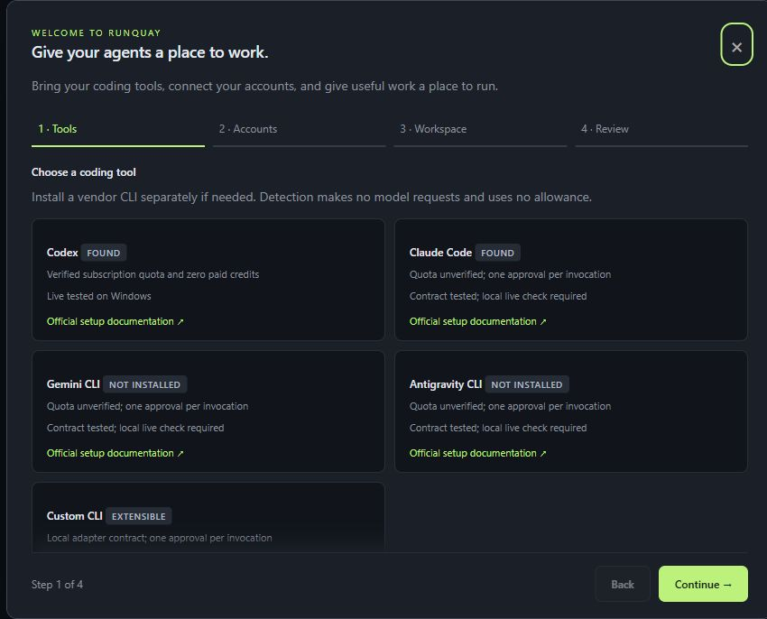

Codex and Claude Code were detected. Gemini and Antigravity were absent on this machine. Detection does not mean every adapter was live-executed.

### 2. Actual subscription verification

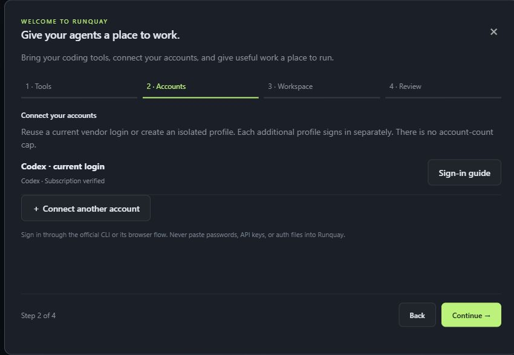

The generic profile label is the real default label. The published view includes no account email, sign-in token or vendor home path.

### 3. Real workspace selection

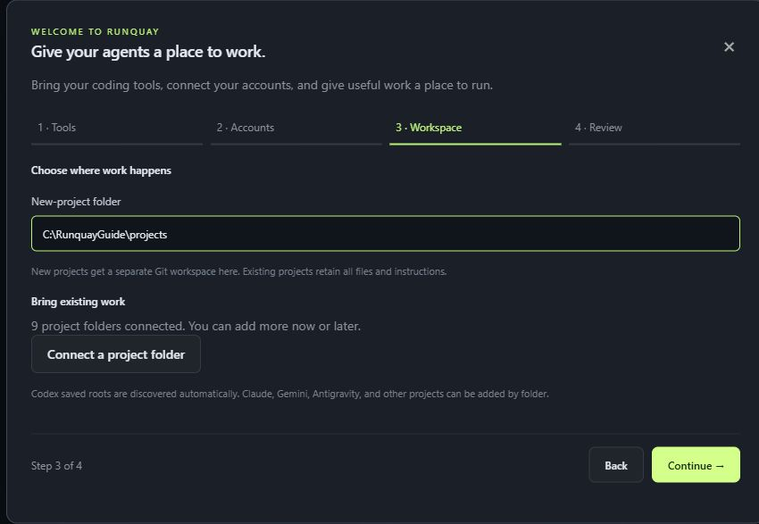

### 4. Actual review screen

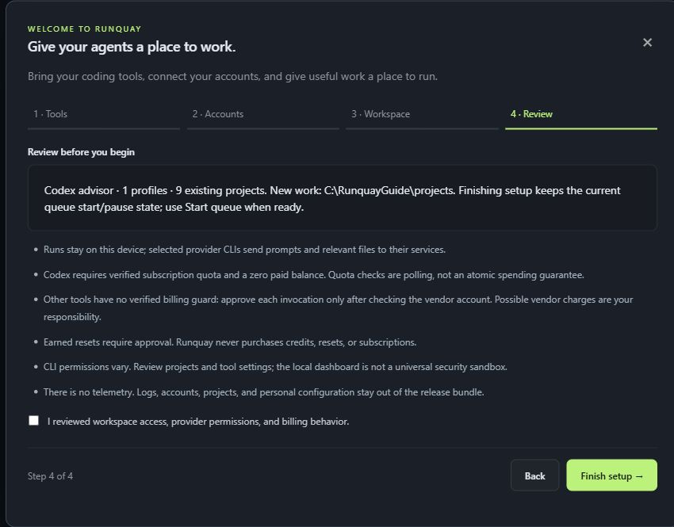

## A real project run

### Project goal and limits

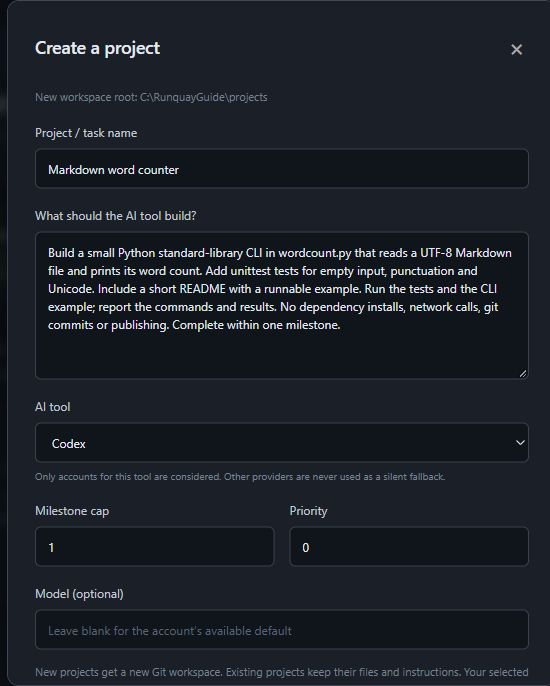

### Running task

### Completed task and checks

## Other application controls

### Connect an account

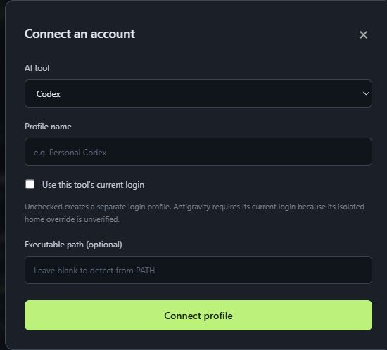

### Import the generated project

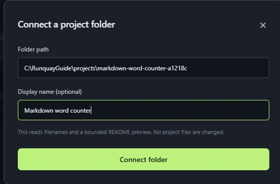

### Configure bounded work

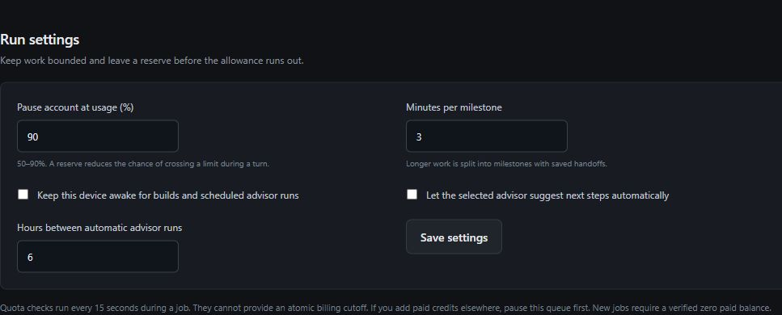

## Screenshot publication policy

Only these reviewed JPEGs enter source packaging. `release-manifest.json` pins each file's SHA256 digest; changed bytes require another review and updated manifest. Arbitrary raster images elsewhere remain excluded. The audit also rejects EXIF/XMP metadata in approved images. Hash pinning detects changes after review; it cannot determine whether the visible pixels contain confidential information. Review every image visually before adding it or sharing new captures.

See the [setup guide](GETTING_STARTED.md), [workflow guide](WORKFLOWS.md), [troubleshooting guide](TROUBLESHOOTING.md) and [verification record](VERIFICATION.md).
