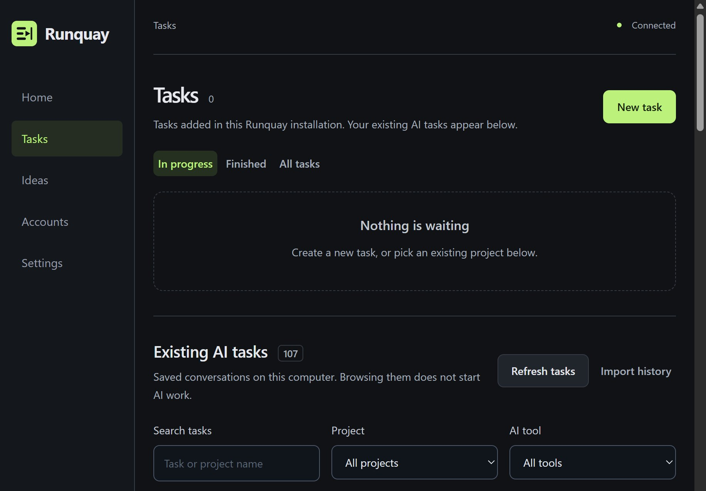

# Find saved tasks from your AI tools

Open **Tasks → Existing AI tasks**. Runquay finds saved conversations on this computer even while work is paused. You do not need to connect another account or ask AI for ideas to browse them.



## Find the conversation you want

1. Choose an **AI tool**, or keep **All tools** to see everything together.
2. Use **Search tasks** for a title, preview or project name. Choose a **Project** to narrow the results further.
3. Open **Task summary** for the bounded preview, recorded folder and source. **Show more** reveals another twelve results.
4. Choose **Refresh tasks** after using an AI tool. Expand **History sources and privacy** to see counts and any incomplete sources.
5. Open the original tool to continue its conversation. Browsing a saved task does not resume it or start AI work.

Under **Use an existing project**, **View existing tasks** selects that folder across all tools. If a conversation has a recorded folder that is not connected yet, **Connect this folder** opens a review form. If no folder was recorded, Runquay says **Folder not recorded**; it does not guess a location from a prompt.

To start separate work, choose **Add a new task in this project**, write your new goal and review it before saving. The native tool is preselected where supported. This creates a new Runquay task; the original conversation is not transferred. Work can start after saving if scheduling is enabled and an eligible account or required approval is available.

## What is detected automatically?

| Tool | Local source | Limits |
| --- | --- | --- |
| Codex | Official read-only app-server task metadata for the current login | Up to 1,000 recent top-level tasks; archived, ephemeral and child tasks are excluded. Isolated Codex login histories are not combined. |
| Claude Code | Session files under `~/.claude/projects`; configured `CLAUDE_CONFIG_DIR` and registered profile homes | Text previews and titles only; sidechain/subagent, hidden and empty sessions are skipped. A later title outside bounded reads can be missed. |
| Gemini CLI | JSON and JSONL session files under `~/.gemini/tmp/*/chats`; configured `GEMINI_CLI_HOME` and registered profile homes | Startup-only and subagent sessions are skipped. Folder association requires the local `.project_root` marker. |
| Antigravity | Available desktop, IDE and CLI transcripts under the three Antigravity directories in `~/.gemini`; CLI cached conversation references | Older encrypted conversation files are not decoded. A cached reference may be stale. A folder is linked only when an explicit working directory is retained. Missing information is shown in the app. |
| Other tools | A compatible metadata JSON file you choose | No universal cloud-history API or arbitrary native export parser. Use the format below. |

Readers use fixed vendor directories rather than searching your whole disk. Claude/Gemini/Antigravity discovery opens no vendor authentication files and launches no vendor process. JSONL reads use the first 128 KB and last 32 KB; JSON metadata is limited to 2 MB. At most 1,000 recent files per native adapter are processed. A tool update, missing local cache, permission restriction or unsupported format can make a list incomplete. A failed adapter does not prevent the others from loading.

See the official [Claude session documentation](https://code.claude.com/docs/en/agent-sdk/sessions), [Gemini session management](https://geminicli.com/docs/cli/session-management/), [Antigravity transcript hooks](https://www.antigravity.google/docs/hooks), and [Antigravity CLI conversation cache](https://antigravity.google/docs/cli/commands/resume). Runquay uses bounded standard-library readers for the non-Codex sources; installing an SDK is unnecessary.

## Import metadata from another tool

Use **Import history → Choose history file**. Choose a JSON file below 60 KB containing 1–100 tasks in this format:

```json
{
  "version": 1,
  "tool": "My AI helper",
  "tasks": [
    {
      "id": "conversation-001",
      "title": "Improve the homepage",
      "preview": "Check navigation and keyboard access.",
      "updated_at": "2026-10-09T12:00:00Z"
    }
  ]
}
```

`id` and `title` are required. `preview`, `updated_at` and `cwd` are optional. If included, `cwd` must be an absolute folder path on this computer. A nontechnical user may need help converting a vendor's export; raw ChatGPT, Cursor, Copilot or other proprietary exports are not automatically understood.

Successful import adds a tool filter. Importing the same tool and task ID updates that entry rather than duplicating it. The imported list holds up to 1,000 entries. Only the documented metadata fields are retained. An invalid export leaves the previous list intact. Imported task content is displayed as plain text, never executed. Do not put credentials or private material in a file you intend to share publicly.

## Your local queue and privacy

The task queue at the top belongs to **this Runquay installation**. Existing AI conversations appear below it. Their saved previews do not establish completion or the live status of another process. Tasks in an older Runquay data directory remain there; a fresh walkthrough does not copy or restart them. Use **Finished** or **All tasks** in that installation to see its completed work.

Titles, bounded previews and folder associations are cached in Runquay's private local data directory. Browsing and importing make no model requests, sign-ins, purchases or paid resets. Those private caches are excluded from public source packages. The public screenshot above contains only the history header and controls; personal task details are outside the capture.

Requested AI planning can send scoped project context and recent Codex previews to the selected provider. Newly discovered Claude, Gemini, Antigravity and imported previews are not automatically added to advisor context. If you copy a summary into a new task goal, it becomes part of that task's AI request. Review goals and logs before sharing them.

[Beginner setup](BEGINNERS.md) · [Tool connections and execution limits](TOOLS.md) · [Verification record](VERIFICATION.md)
